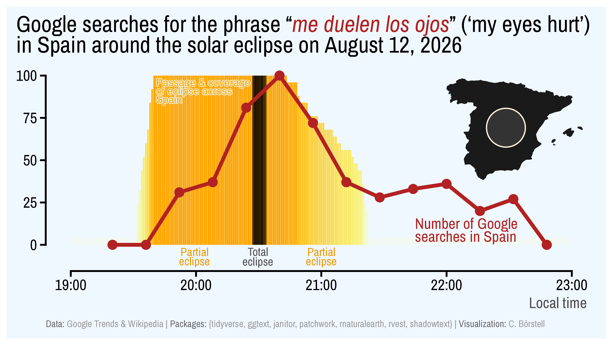

# Don't look up

A plot of Google searches for *me duelen los ojos* ('my eyes hurt') in Spain around the solar eclipse on August 12, 2026 showing an increase in the search numbers from the start of the (partial) eclipse and peaking right after the total eclipse.
